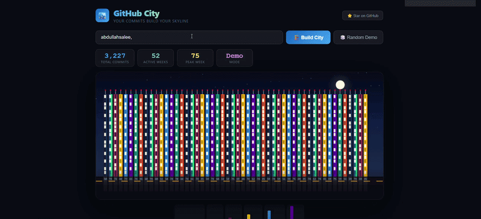

# 🏙️ GitHub City

> **Your GitHub commits build a living, animated city skyline.**
> The more you commit, the taller your buildings grow.


---



## ✨ Live Demo

🔗 **([https://github-city.vercel.app/?user=abdullahsaleem786](https://github-city-alpha.vercel.app/))**

---

## 🏗️ How It Works

| Commits per week | Building |
|---|---|
| 0 commits | 🪨 Empty lot |
| 1–2 commits | 🏠 Small house |
| 3–5 commits | 🏢 Small building |
| 6–10 commits | 🏬 Office block |
| 11–20 commits | 🏙️ Skyscraper |
| 21+ commits | 🌆 Mega tower |

Your entire year of GitHub activity is rendered as an **animated night city** — with flickering windows, blinking rooftop lights, moving traffic, and a glowing moon.

---

## 🚀 Use It For Your Profile

Add this to your GitHub Profile README:

```markdown
[](https://github-city.vercel.app/?user=YOUR_USERNAME)
```

Replace `YOUR_USERNAME` with your GitHub username. It updates automatically every day! 🔄

---

## 🛠️ Run It Locally

```bash
# 1. Clone the repo
git clone https://github.com/abdullahsaleem786/github-city.git

# 2. Go into the folder
cd github-city

# 3. Install dependencies
npm install

# 4. Start the app
npm start

# Opens at http://localhost:3000
```

---

## 🌍 Self-Host on Vercel (Free)

1. Fork this repository
2. Go to [vercel.com](https://vercel.com)
3. Click **"Add New Project"** → Import your fork
4. Click **"Deploy"** — done in 60 seconds!
5. Visit: `https://your-app.vercel.app/?user=YOUR_USERNAME`

---

## 🤝 Contributing

Contributions are welcome! Here's how:

1. **Fork** this repo
2. Create a branch: `git checkout -b feature/your-feature`
3. Make your changes
4. Commit: `git commit -m "✨ Add your feature"`
5. Push: `git push origin feature/your-feature`
6. Open a **Pull Request**

Ideas for contributions:
- 🌅 Day/night mode toggle
- 🌧️ Weather effects (rain, snow)
- 📊 More building styles
- 🎨 Custom color themes
- 📱 Better mobile layout

---

## 📦 Tech Stack

- **React** — UI framework
- **HTML Canvas** — City rendering & animation
- **GitHub Contributions API** — Live contribution data
- **Vercel** — Hosting & deployment

---

## 📄 License

MIT License — free to use, modify, and share. See [LICENSE](LICENSE) for details.

---

## 👤 Author

Made with ❤️ by [@abdullahsaleem786](https://github.com/abdullahsaleem786)

If you find this useful, please ⭐ **star the repo** — it helps others discover it!

[](https://github.com/abdullahsaleem786/github-city)
